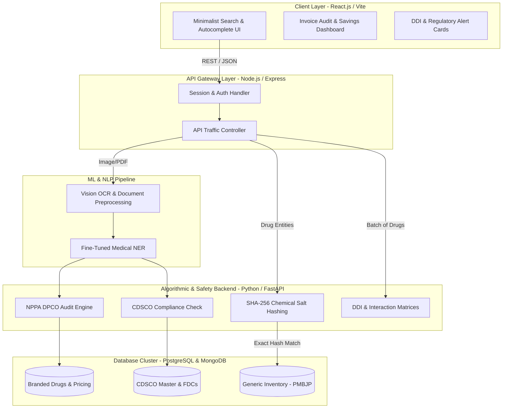

# GenMed

**Deterministic Exact-Match Generic Medicine Mapping & Healthcare Safety Platform**

GenMed is a decoupled full-stack microservices platform designed to solve information asymmetry and high pharmaceutical costs in India. By bypassing probabilistic guesses in drug substitution, GenMed implements a strict, zero-risk cryptographic exact-match engine that maps branded pharmaceutical products to generic alternatives. It extends into comprehensive regulatory compliance, automated visual bill auditing, and advanced pharmacological safety intelligence tailored to the Indian healthcare ecosystem.

---

## Key Features

### Core Infrastructure & Generic Substitution (Phases 1 & 2)
* **Autocomplete Query Input:** Strict dropdown populated from indexed MongoDB fields to eliminate typos and invalid input variations.
* **Deterministic Salt-Hash Substitution:** Normalizes chemical salts, hashes them with SHA-256, and executes an exact-match query against the PMBJP catalog.
* **Savings Gauge:** Calculates percentage and absolute savings dynamically using real-time MRP comparisons.
* **Geospatial Kendra Locator:** Executes MongoDB geospatial queries to locate the nearest physical Janaushadhi stores.

### Advanced Auditing & Safety (Phases 3 to 6)
* **Intelligent Invoice Auditor (OCR & NLP):** Scans physical pharmacy bills or medicine strip photos. Uses advanced Optical Character Recognition and Named Entity Recognition (NER) to extract batch, expiry, and printed MRP.
* **NPPA Price Audit Engine:** Audits extracted invoice data against DPCO Schedule-I Ceiling Prices and statutory Maximum Retail Prices to flag illegal overcharging.
* **CDSCO Regulatory Compliance Engine:** Verifies formulations against CDSCO master registries and Ministry of Health gazettes to flag banned Fixed Dose Combinations (FDCs).
* **Pharmacological Safety & DDI Checker:** Cross-references multi-drug regimens or invoice items against RxNorm and clinical interaction matrices to warn of severe Drug-Drug Interactions.
* **Epidemiological Surveillance:** Aggregates search trends by chemical salt and region for localized public health monitoring.

---

## System Architecture

The architecture separates document ingestion, NLP text structuring, and parallel domain-audit services to process visual bills and real-time drug safety checks without latency bottlenecks.



---

## Workflow Outline

1. **Ingestion Layer:** Users can search via text autocomplete, upload PDF bills, or provide direct photos of medicine strips.
2. **Text Normalization:** Raw OCR text is fed into a specialized medical NER extraction pipeline to output structured data.
3. **Audit & Substitution:** The Pricing Audit Engine validates transactions against statutory thresholds (Printed MRP and DPCO Ceilings). The Hash engine finds affordable generic equivalents.
4. **Safety Verification:** The DDI Checker cross-references active pharmaceutical ingredients using RxNorm identifiers to provide severe interaction alerts and compliance badges.
5. **Output:** A unified report combining CDSCO approval status, precise overcharge amounts, generic savings, and DDI alerts is delivered to the user.

---

## Database Schemas

### 1. Branded Drugs & Catalogs
```json
{
  "_id": "ObjectID",
  "brand_name": "String (Indexed)",
  "active_ingredients": [
    { "salt": "String", "strength": "String" }
  ],
  "salt_composition_hash": "String (SHA-256)",
  "mrp_price": "Decimal"
}
```

### 2. Extracted Invoice Items (NLP Output)
```json
{
  "invoice_id": "String",
  "line_items": [
    {
      "brand_name": "String",
      "quantity_units": "Integer",
      "batch_number": "String",
      "expiry_date": "String",
      "printed_mrp_per_pack": "Decimal",
      "paid_price_total": "Decimal"
    }
  ]
}
```

---

## Non-Functional Guarantees (NFR)

* **Clinical Safety:** 100% exact-match rate on chemical composition hashes; probabilistic guesses are blocked.
* **Audit Precision:** Mathematical engine operates with zero calculation drift on statutory GST adjustments. Zero false overcharges.
* **Performance:** Invoice scanner operating under peak concurrency with a target SLA of under 3 seconds.
* **Compliance:** Architecture ensures all geolocated searches exclude personally identifiable identifiers (PII). Medico-legal disclaimers are actively provided for clinical rules.

---

## Getting Started

### Prerequisites

| Tool | Version | Purpose |
|---|---|---|
| Python | 3.10+ | Backend (FastAPI) |
| Node.js | 18+ | Gateway & Frontend |
| npm | 9+ | Package management |
| MongoDB Atlas | — | Cloud database (URI required in `.env`) |

---

### 1. Environment Setup

**Backend** — create `backend/.env`:
```env
MONGO_URI=mongodb+srv://<user>:<password>@<cluster>.mongodb.net/
DB_NAME=genmed_db
```

**Gateway** — `gateway/.env` is already configured:
```env
PORT=5000
FASTAPI_BASE_URL=http://127.0.0.1:8000
```

---

### 2. Install Dependencies

```bash
# Backend — create & activate virtual environment
cd backend
python -m venv venv
venv\Scripts\activate          # Windows
pip install -r requirements.txt
```

> `requirements.txt` includes: `fastapi`, `uvicorn[standard]`, `pydantic`, `pymongo[srv]`, `pandas`, `requests`, `python-dotenv`

```bash
# Gateway
cd ../gateway
npm install

# Frontend
cd ../frontend
npm install
```

---

### 3. Run the Project

#### ⚡ One-Command Launch (Recommended)

From the project root, simply double-click **`start-all.bat`** or run in PowerShell:

```powershell
.\start-all.ps1
```

This opens **3 separate terminal windows** simultaneously:

| Service | URL |
|---|---|
| 🟢 Backend (FastAPI) | http://localhost:8000 |
| 🟡 Gateway (Express) | http://localhost:5000 |
| 🟣 Frontend (Vite) | http://localhost:5173 |

> **Note:** If PowerShell blocks the script, run once: `Set-ExecutionPolicy -Scope CurrentUser RemoteSigned`

---

#### Manual Launch (per service)

Open three separate terminals and run each command:

**Terminal 1 — Backend**
```bash
cd backend
venv\Scripts\activate
uvicorn main:app --reload --port 8000
```

**Terminal 2 — Gateway**
```bash
cd gateway
npm run dev
```

**Terminal 3 — Frontend**
```bash
cd frontend
npm run dev
```

---

### 4. Verify Everything is Running

- **API Docs (Swagger):** http://localhost:8000/docs
- **Health Check:** http://localhost:8000/
- **Frontend UI:** http://localhost:5173
