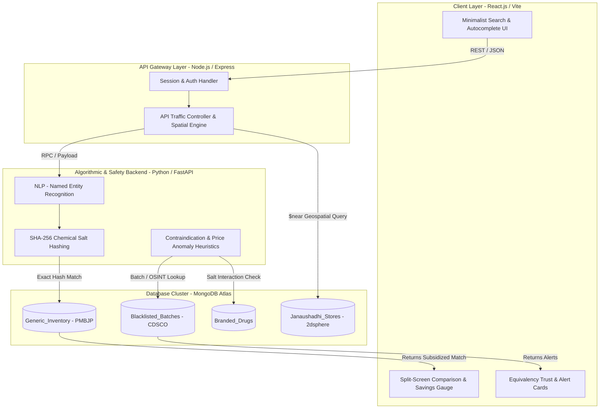
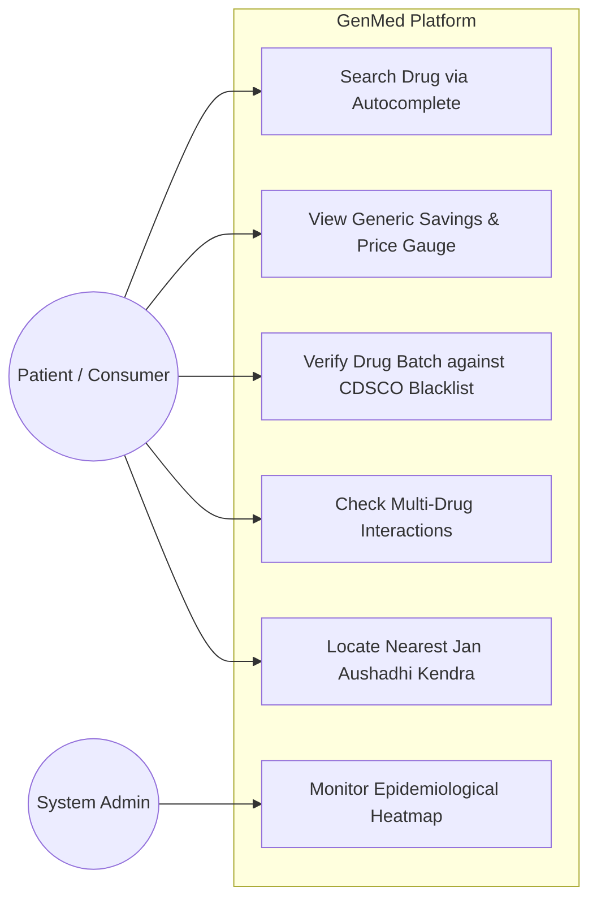

# GenMed

> **Deterministic Exact-Match Generic Medicine Mapping & Healthcare Safety Platform**

GenMed is a decoupled full-stack microservices platform designed to solve information asymmetry and high pharmaceutical costs in India. By bypassing probabilistic guesses (like LLMs or vector similarities) in drug substitution, GenMed implements a strict, **zero-risk cryptographic exact-match engine** that maps branded pharmaceutical products to generic alternatives cataloged under the Pradhan Mantri Bhartiya Janaushadhi Pariyojana (PMBJP) program. It wraps this engine in advanced clinical safety checks, geospatial tracking, and epidemiological monitoring tools.

---

## 🚀 Key Features

* **🔍 Autocomplete Query Input (FR-1):** Strict dropdown populated from indexed MongoDB fields to eliminate typos and invalid input variations.
* **🏷️ NLP-NER Extraction (FR-2):** Parses unstructured queries into structured drug entities: `[Brand_Name, Active_Salt, Strength, Dosage_Form]`.
* **🔒 Deterministic Salt-Hash Substitution (FR-3 & FR-4):** Normalizes chemical salts (lowercase, sorted alphabetically), hashes them with SHA-256, and executes an exact-match query. Fails securely with clinical warnings if no exact match exists.
* **💰 Savings Gauge (FR-5):** Calculates percentage and absolute rupee savings dynamically using real-time MRP comparisons.
* **🛡️ Equivalency Trust & Side-Effects (FR-6):** Displays cross-referenced side-effect profiles bound to the SHA-256 hash, visualising generic equivalence.
* **⚠️ Multi-Drug Contraindication Validation (FR-7):** Cross-references multi-drug regimens against the OpenFDA interaction matrix to warn of adverse events.
* **📋 CDSCO Batch Verification (FR-8):** Allows users to search batch numbers against real-time CDSCO recall bulletins for Not of Standard Quality (NSQ) flags.
* **📈 Price-Anomaly Heuristic (FR-9):** Flags potential counterfeit distribution or market dumping if user-logged purchase price is below 40% of official MRP.
* **📍 Geospatial Kendra Locator (FR-10):** Executes MongoDB `$near` queries on a `2dsphere` index to locate the 3 nearest physical Janaushadhi stores.
* **🗺️ Epidemiological Heatmap (FR-11):** Aggregates health search trends by chemical salt and region over sliding 48-hour windows for admin-level disease surveillance.

---

## 🏗️ System Architecture



### Flowchart / User Experience



---

## 📊 Database Schema (MongoDB Specification)

### 1. `Branded_Drugs` Collection
```json
{
  "_id": "ObjectID",
  "brand_name": "String (Indexed)",
  "manufacturer": "String",
  "active_ingredients": [
    { "salt": "String", "strength": "String" }
  ],
  "salt_composition_hash": "String (SHA-256)",
  "mrp_price": "Decimal"
}
```

### 2. `Generic_Inventory` Collection (PMBJP Catalog)
```json
{
  "_id": "ObjectID",
  "drug_code": "String",
  "generic_name": "String",
  "active_ingredients": [
    { "salt": "String", "strength": "String" }
  ],
  "salt_composition_hash": "String (Strict Unique Index)",
  "jan_aushadhi_price": "Decimal",
  "unit_size": "String"
}
```

### 3. `Blacklisted_Batches` Collection (CDSCO OSINT)
```json
{
  "_id": "ObjectID",
  "drug_name": "String",
  "batch_number": "String (Indexed)",
  "manufacturer_on_label": "String",
  "reason_for_recall": "String",
  "alert_month": "String"
}
```

### 4. `Janaushadhi_Stores` Collection (Geospatial)
```json
{
  "_id": "ObjectID",
  "store_id": "String",
  "address": "String",
  "location": {
    "type": "Point",
    "coordinates": ["Longitude", "Latitude"]
  }
}
```

---

## ⚙️ Hashing Algorithm & Substitution Logic

```
   [User Search: Branded Drug]
                │
                ▼
   [Extract Active Salt Ingredients] 
     (e.g., "Paracetamol", "Caffeine")
                │
                ▼
   [Normalize & Sort String]
     "caffeine+paracetamol"
                │
                ▼
   [Generate SHA-256 Hash]
     "e3b0c44298fc1c149afbf4c8996fb..."
                │
                ▼
   [Query MongoDB Generic_Inventory]
     using exact-match on salt_composition_hash
         ├──► [Match Found] ──► Return Subsidized Generic Alternative
         └──► [No Match]    ──► Zero-Risk Clinical Failsafe Alert
```

---

## 🛡️ Non-Functional Guarantees (NFR)

* **NFR-1: Clinical Safety:** 100% exact-match rate on chemical composition hashes; probabilistic guesses are blocked.
* **NFR-2: Performance:** Sub-500ms end-to-end response time for all query lookups.
* **NFR-3: Scalability:** Stateless, containerized microservices ready for Docker & Kubernetes deployment.
* **NFR-4: Compliance & PII:** HIPAA/GDPR-aligned design ensuring all geolocated searches exclude personally identifiable identifiers (PII).
