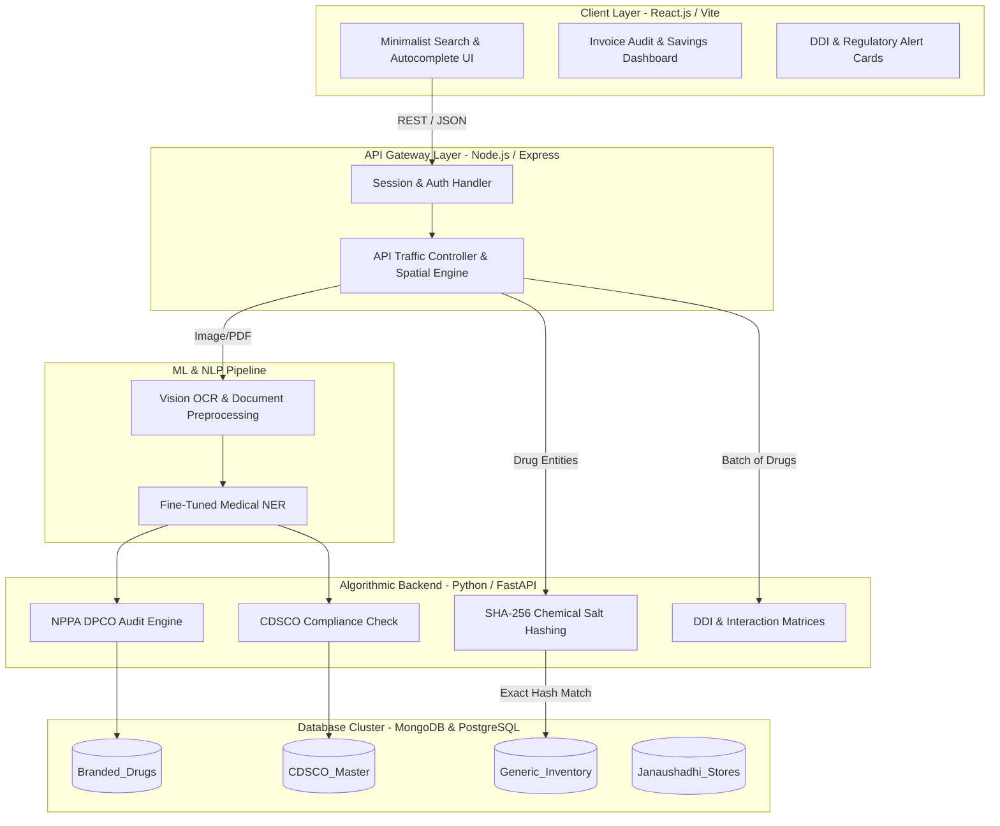
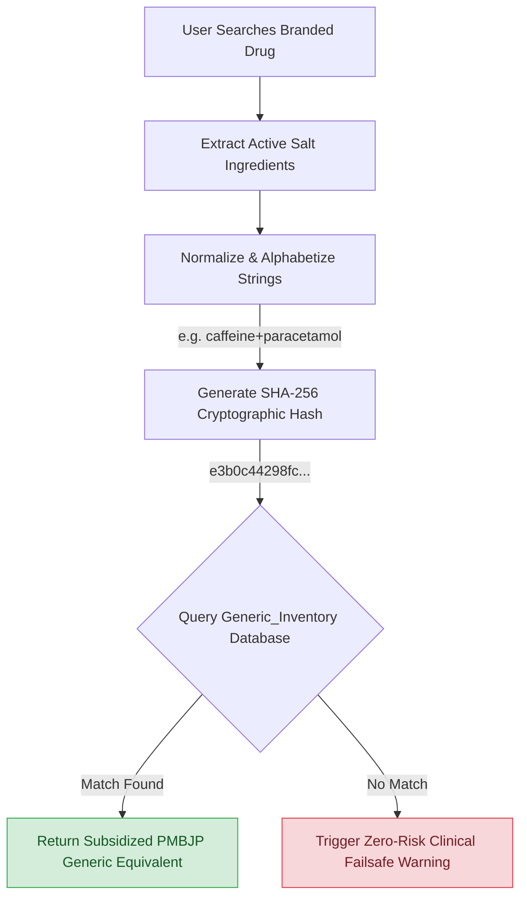
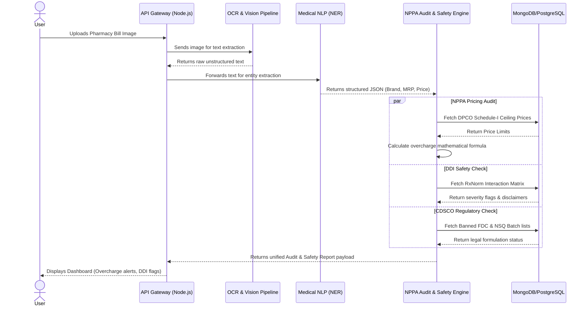
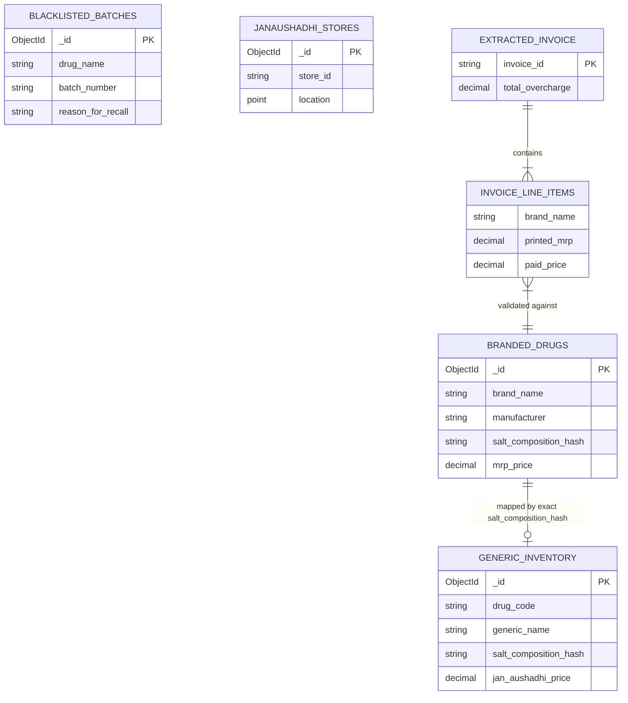

# CAPSTONE PROJECT C1 SUBMISSION REPORT
# SOFTWARE REQUIREMENT SPECIFICATION (SRS) & SYSTEM DESIGN
**Project Title:** GenMed: A Deterministic Exact-Match Generic Medicine Mapping & Healthcare Safety Platform  
**Student Name:** Nihal Panwar  
**Class / Register No:** 4MCA  
**Institution:** Christ University  
**Alignment:** UN SDG 3 (Good Health and Well-being) & UN SDG 9 (Industry, Innovation, and Infrastructure)  

---

## SECTION 1: PROJECT SYNOPSIS & SDG ALIGNMENT

### 1.1 Abstract & Project Objectives
GenMed is an advanced healthcare informatics platform designed to bridge the severe information asymmetry and cost barrier in Indian pharmaceuticals. While government-subsidized generic equivalents exist via the Pradhan Mantri Bhartiya Janaushadhi Pariyojana (PMBJP) network, patients routinely pay exorbitant prices for branded monopolies due to complex medical jargon, fragmented data, and opaque retail billing. 

**Core Objectives:**
1. **Deterministic Generic Mapping:** Replace error-prone probabilistic AI search with a strict, rule-based hash-matching engine that maps branded prescriptions to verified Active Pharmaceutical Ingredients (APIs).
2. **Clinical Safety & Interoperability:** Integrate real-time drug-drug interaction (DDI) detection cross-referencing multi-drug regimens using RxNorm and contraindication matrices.
3. **Regulatory Compliance & Fraud Prevention:** Automate OSINT-driven CDSCO blacklist verification and flag banned Fixed Dose Combinations (FDCs) from Ministry of Health gazettes.
4. **Visual Bill Auditing (OCR & NLP):** Enable consumers to upload physical pharmacy bills to extract line items using Medical Named Entity Recognition (NER) and validate charged prices against NPPA/DPCO ceiling thresholds to prevent overcharging.
5. **Last-Mile Accessibility:** Provide dynamic geospatial indexing to route patients to the nearest physical Jan Aushadhi Kendra.

### 1.2 Alignment with UN Sustainable Development Goals (SDGs)
* **SDG 3: Good Health and Well-being:** Directly democratizes access to essential, high-quality generic medicines, alleviating the crushing financial burden of chronic and acute care treatments, whilst ensuring pharmacological safety.
* **SDG 9: Industry, Innovation, and Infrastructure:** Introduces a scalable, microservices-driven technical architecture with embedded computer vision and NLP that transforms static government datasets into an active, intelligent health-tech utility.

---

## SECTION 2: ANALYSIS PHASE (EXISTING SYSTEM & LIMITATIONS)

### 2.1 Existing Systems & Current Market Landscape
Current retail pharmacy apps and commercial discovery tools rely on **Probabilistic Matching** (e.g., Cosine Similarity, Vector Embeddings, or fuzzy text search) to recommend alternatives, and focus entirely on e-commerce rather than physical invoice auditing or regulatory safety nets.

### 2.2 Critical Limitations of Current Systems
1. **The Hallucination Liability:** Probabilistic AI models can misinterpret textual similarities, leading to incorrect drug substitutions. In healthcare, an 82% "guess" is a critical clinical hazard.
2. **Lack of Interaction Oversight:** Existing search platforms focus solely on brand-to-brand cost comparison without verifying whether stacking certain generic alternatives triggers adverse drug-drug interactions.
3. **Absence of Regulatory Safety Nets:** Consumers have no automated mechanism to cross-reference whether a purchased or prescribed medicine batch belongs to a government-recalled or substandard (spurious) manufacturing batch, or if it constitutes a banned FDC.
4. **Financial Exploitation at the Counter:** Fragmented pricing data leaves patients vulnerable to retail-level overcharging above the Maximum Retail Price (MRP) or NPPA/DPCO ceiling limits, with no means to easily audit their physical receipts.

---

## SECTION 3: PROPOSED SYSTEM ARCHITECTURE & DATA FLOW

GenMed solves these challenges by enforcing **absolute mathematical certainty** for mapping, combined with **advanced NLP pipelines** for bill auditing, through a decoupled microservices model.

* **Client Layer (React.js / Vite):** Highly responsive UI featuring strict autocomplete constraints, dynamic savings gauges, physical invoice upload tools, side-effect trust cards, and interactive map rendering.
* **Gateway Layer (Node.js / Express):** Manages user authentication, request rate-limiting, handles image uploads (bills), and routes traffic between the client and downstream services.
* **Computational, ML & Safety Service (Python / FastAPI):** Executes NLP-NER parsing of unstructured inputs and OCR extracted text, SHA-256 chemical salt hashing, contraindication matrix (RxNorm) cross-referencing, CDSCO FDC / blacklist lookups, and NPPA DPCO price anomaly math.
* **Data Cluster (MongoDB/PostgreSQL):** Houses indexed collections for Branded Drugs, PMBJP Generic Inventories, CDSCO Master Registries and FDCs, NPPA DPCO Pricing limits, and Geospatial Kendra locations.

### 3.1 System Data Flow Diagram



### 3.2 Deterministic Hash Mapping Engine Logic



---

## SECTION 4: FUNCTIONAL REQUIREMENTS (FR)

* **FR-1: Autocomplete Query Input:** The UI must enforce search input via a dropdown populated by indexed text fields to eliminate syntax errors, typos, and open-domain text variations.
* **FR-2: Deterministic Salt-Hash Substitution:** The engine must normalize the chemical salt string (lowercase, alphabetically ordered) and compute a SHA-256 cryptographic hash. Substitution lookup must execute an exact-match query against the PMBJP catalog's `salt_composition_hash`.
* **FR-3: Zero-Risk Clinical Failsafe:** If an exact SHA-256 hash match is missing, the system must fail securely. It shall not fall back on probabilistic similarity and must return an explicit clinical warning payload.
* **FR-4: Visual Bill Ingestion & OCR:** The system must accept physical pharmacy bill photos or PDF invoices, process them through OCR (accounting for slanted scans and thermal paper fade), and extract raw text.
* **FR-5: Medical NLP-NER Parameter Extraction:** An NLP NER pipeline must parse OCR text into structured tuples (e.g., Brand, Batch Number, Quantity, Expiry, Printed MRP, Charged Rate).
* **FR-6: NPPA DPCO Pricing Audit:** The backend must audit the extracted charged rate against the printed MRP and the DPCO Schedule-I ceiling price thresholds. Any overcharge > 0 must generate an automated dispute alert citing statutory rules.
* **FR-7: Regulatory CDSCO & FDC Verification:** The system must cross-reference mapped formulations against CDSCO master registries and Ministry of Health gazettes to output a deterministic legal status (Approved, Banned FDC, Schedule H/H1/X).
* **FR-8: Multi-Drug Contraindication Validation (DDI):** The system must accept multi-item invoices or combinations, map APIs to RxNorm identifiers, and query OpenFDA/DrugBank interaction matrices to output severity-stratified drug-drug interaction alerts (High/Moderate/Low).
* **FR-9: CDSCO Regulatory Batch Verification:** Users can search batch numbers to query CDSCO lists for known "Not of Standard Quality" (NSQ) or Spurious recalls.
* **FR-10: Last-Mile Kendra Geospatial Locator:** The gateway must execute a MongoDB `$near` query on a `2dsphere` index to return the nearest verified Jan Aushadhi pharmacies based on GPS coordinates.
* **FR-11: Epidemiological Surveillance Heatmap (Admin):** Aggregate search queries by chemical salt and region over 48-hour windows to detect localized public health spikes.

### 4.1 Sequence Diagram: Invoice Auditing & Safety Checks



---

## SECTION 5: NON-FUNCTIONAL REQUIREMENTS (NFR)

* **NFR-1: Clinical Accuracy (0% False-Positive Rate):** The substitution engine must achieve a 100% exact-match rate on hashes. Probabilistic approximations are strictly disallowed. DDI severity engines must strictly follow referenced clinical pharmacological rules without AI generation drift.
* **NFR-2: OCR & NER Extraction Precision:** Line-Item NER extraction F1 Score must be >= 88%, and OCR character accuracy must be >= 93% for standard Indian thermal pharmacy bills.
* **NFR-3: Audit Mathematical Precision:** Zero calculation drift on statutory GST adjustments. The system must report 0% false overcharges in audit mathematics.
* **NFR-4: Performance & Latency:** Multi-drug invoice parsing, NER extraction, and simultaneous safety auditing (DDI/NPPA) must process under a target SLA of 3 seconds. End-to-end standard hash queries must execute in < 250ms.
* **NFR-5: High Availability & Data Security:** Microservices must be stateless and containerized. All queries must exclude PII for compliance with Indian Digital Health guidelines.

---

## SECTION 6: SYSTEM DESIGN & DATABASE SCHEMA (MONGODB/JSON SPECIFICATIONS)

### 6.1 Database Entity Relationship Diagram (ERD)



### 6.2 Branded_Drugs Collection
```json
{
  "_id": "ObjectID",
  "brand_name": "String (Indexed)",
  "manufacturer": "String",
  "active_ingredients": [
    { "salt": "String", "strength": "String" }
  ],
  "salt_composition_hash": "String (SHA-256)",
  "mrp_price": "Decimal"
}
```

### 6.3 Extracted NLP Line Items (Internal Payload Structure)
```json
{
  "invoice_id": "String",
  "line_items": [
    {
      "raw_text": "String",
      "extracted": {
        "brand_name": "String",
        "quantity_units": "Integer",
        "form_factor": "String",
        "batch_number": "String",
        "expiry_date": "String",
        "printed_mrp_per_pack": "Decimal",
        "paid_price_total": "Decimal"
      }
    }
  ]
}
```

### 6.4 Blacklisted_Batches Collection (CDSCO OSINT)
```json
{
  "_id": "ObjectID",
  "drug_name": "String",
  "batch_number": "String (Indexed)",
  "reason_for_recall": "String",
  "alert_month": "String"
}
```

### 6.5 Janaushadhi_Stores Collection (Geospatial)
```json
{
  "_id": "ObjectID",
  "store_id": "String",
  "address": "String",
  "location": {
    "type": "Point",
    "coordinates": ["Longitude", "Latitude"]
  }
}
```

---

## SECTION 7: EXPECTED OUTCOMES & SPECIALIZATION CONCEPTS

### 7.1 Expected Outcomes
* Delivery of a secure web platform capable of slashing patient drug expenditure significantly through both subsidized substitution and automatic overcharge protection.
* Elimination of clinical risk via deterministic matching and real-time DDI evaluations against multi-item invoices.
* Improved consumer protection by bridging the regulatory gap between physical invoices and statutory CDSCO/NPPA data.

### 7.2 Specialization Concepts Used
* **Computer Vision & OCR:** For reading dot-matrix and thermal pharmaceutical bills.
* **Natural Language Processing (NLP):** Specialized Medical Named Entity Recognition (NER) to structure unstructured invoice text.
* **Data Science & Cryptography:** Salt-composition string normalization and cryptographic SHA-256 hashing.
* **Full-Stack Microservices Architecture:** Decoupled Node.js gateway communicating with a Python/FastAPI ML/computational backend.

---

## SECTION 8: PRESENTATION SLIDE OUTLINE (12 SLIDES)

* **Slide 1:** Title Slide (Project Name, Student Details, Institutional Affiliation)
* **Slide 2:** Problem Statement (Information Asymmetry, High Pricing, Regulatory Violations)
* **Slide 3:** SDG Alignment (SDG 3: Health & SDG 9: Infrastructure)
* **Slide 4:** Limitations of Existing Systems (Probabilistic Guessing, Lack of Invoice Transparency)
* **Slide 5:** Proposed Architecture (Microservices: React, Node.js, FastAPI, NLP Pipeline, MongoDB)
* **Slide 6:** Core Innovation 1: Deterministic Exact-Match Engine
* **Slide 7:** Core Innovation 2: Visual Invoice OCR & NLP Extraction
* **Slide 8:** Advanced Safety Modules: CDSCO Banned FDC Verification
* **Slide 9:** Audit Mechanics: NPPA DPCO Pricing Overcharge Calculations
* **Slide 10:** Clinical Safety: DDI Interaction Checker (RxNorm Graph)
* **Slide 11:** Expected Outcomes & Real-World Cost / Risk Reductions
* **Slide 12:** Conclusion & Future Roadmap

---

## SECTION 9: GITHUB REPOSITORY LINK

Project Repository: [https://github.com/panwarnihal/GenMed](https://github.com/panwarnihal/GenMed)